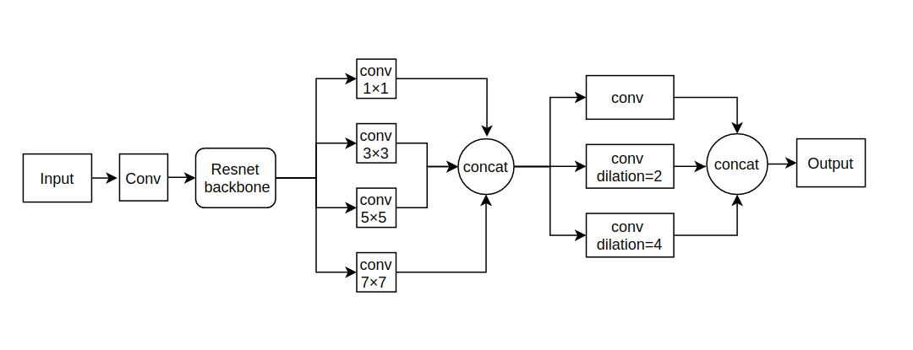
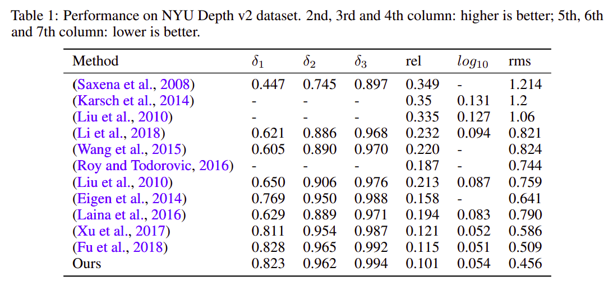
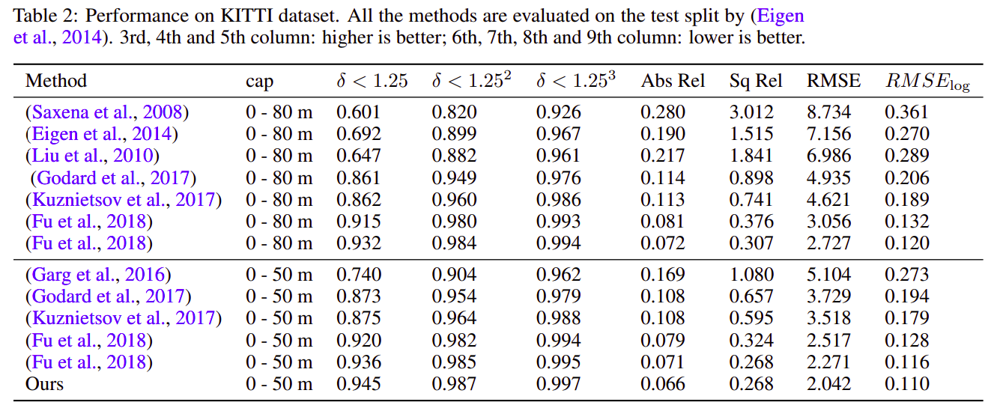
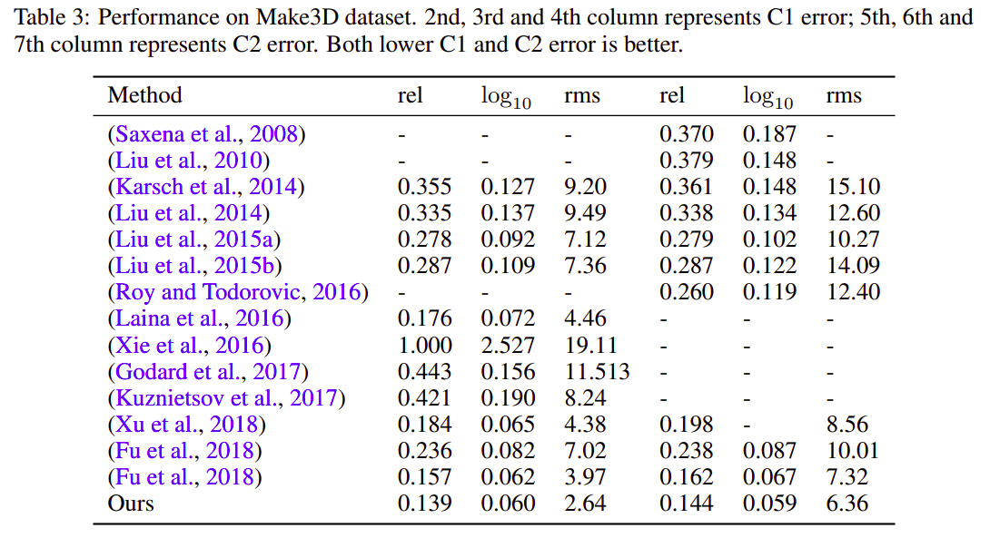
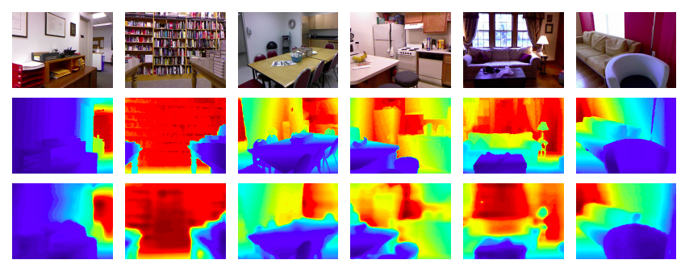
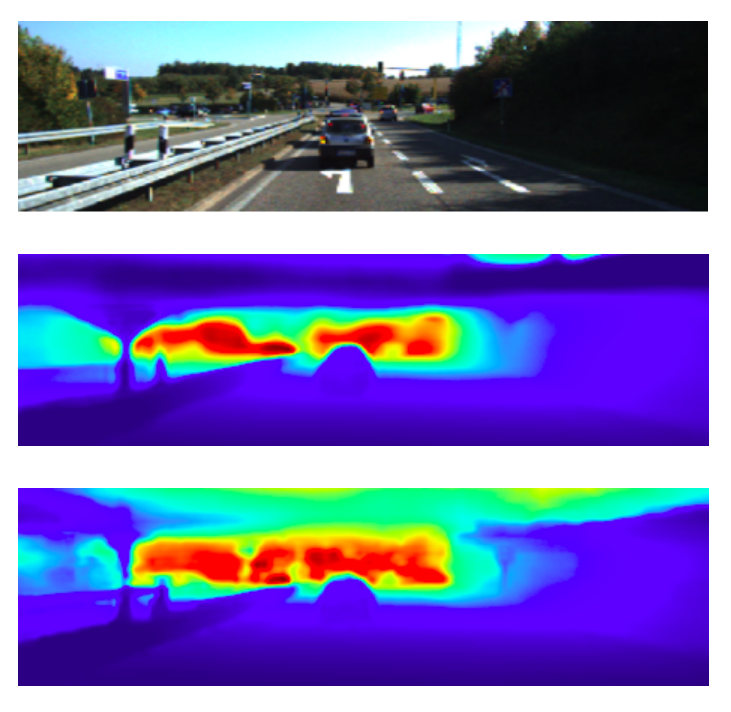
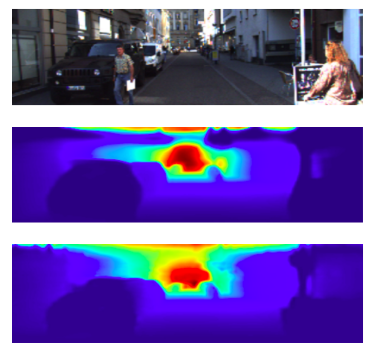

# Monocular Depth Estimation Using Multi Scale Neural Network And Feature Fusion
Code for the paper `Monocular Depth Estimation Using Multi Scale Neural Network And Feature Fusion`.

Link to [Paper](https://abhinavsagar.github.io/files/depth.pdf).

## Abstract

Depth estimation from monocular images is a challenging problem in computer
vision. In this paper, we tackle this problem using a novel network architecture
using multi scale feature fusion. Our network uses two different blocks, first which
uses different filter sizes for convolution and merges all the individual feature maps.
The second block uses dilated convolutions in place of fully connected layers thus
reducing computations and increasing the receptive field. We present a new loss
function for training the network which uses a depth regression term, SSIM loss
term and a multinomial logistic loss term combined. We train and test our network
on Make 3D dataset, NYU Depth V2 dataset and Kitti dataset using standard
evaluation metrics for depth estimation comprised of RMSE loss and SILog loss.
Our network outperforms previous state of the art methods with lesser parameters.

## Data

The following datasets have been used for training and testing our network:

1. `Make3D Range Image Data` - This dataset was one of the first proposed to infer the depth map
from a single image. It has the range data corresponding to each image. Examples from the dataset
include outdoor scenes, indoor scenes and synthetic objects (Saxena et al., 2008).

2. `NYU Depth Dataset V2` - This dataset is made up of video sequences from a variety of indoor
scenes which have been recorded using both RGB and depth cameras. It has 1449 densely labeled
pairs of aligned RGB and depth images. The objects present in the dataset have been individually
labelled with a class id (Silberman et al., 2012). The official split consists of 249 training and 215
testing scenes. The images are of resolution is 480×640.

3. `Kitti dataset` - This large dataset has over 93 thousand depth maps with corresponding raw Lidar
scans and RGB images. This has been the benchmark dataset for depth estimation using a single
image for autonomous driving (Geiger et al., 2013). For benchmarking, Eigen split was done by
(Eigen et al., 2014). The training set consists of approximately 22 600 frames from a total of 28
different scenes and the validation set contains of 888 frames. The test set contains 697 frames from
28 different scenes. The images are of resolution 376×1242.

## Network Architecture



## Usage

Training: `python train.py --data nyu --gpus 4 --bs 8`

Testing: `python test.py`

Evaluate: `python evaluate.py`

## Results

### Comparision with SOTA







### Results for predicted image on NYU dataset



### Results for predicted image on Kitti dataset





## License

```
MIT License

Copyright (c) 2020 Abhinav Sagar

Permission is hereby granted, free of charge, to any person obtaining a copy
of this software and associated documentation files (the "Software"), to deal
in the Software without restriction, including without limitation the rights
to use, copy, modify, merge, publish, distribute, sublicense, and/or sell
copies of the Software, and to permit persons to whom the Software is
furnished to do so, subject to the following conditions:

The above copyright notice and this permission notice shall be included in all
copies or substantial portions of the Software.

THE SOFTWARE IS PROVIDED "AS IS", WITHOUT WARRANTY OF ANY KIND, EXPRESS OR
IMPLIED, INCLUDING BUT NOT LIMITED TO THE WARRANTIES OF MERCHANTABILITY,
FITNESS FOR A PARTICULAR PURPOSE AND NONINFRINGEMENT. IN NO EVENT SHALL THE
AUTHORS OR COPYRIGHT HOLDERS BE LIABLE FOR ANY CLAIM, DAMAGES OR OTHER
LIABILITY, WHETHER IN AN ACTION OF CONTRACT, TORT OR OTHERWISE, ARISING FROM,
OUT OF OR IN CONNECTION WITH THE SOFTWARE OR THE USE OR OTHER DEALINGS IN THE
SOFTWARE.
```

